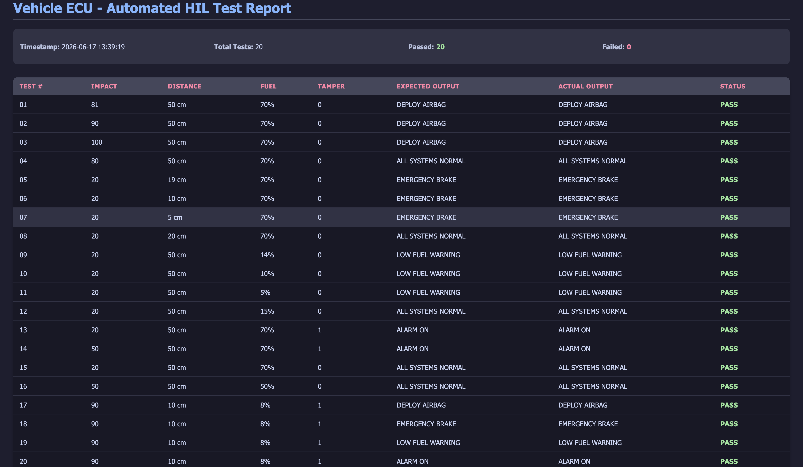

# Smart Vehicle ECU System

> Software simulation of a multi-ECU automotive system using CAN communication in Embedded C.

-blue)


---

## Overview

This project simulates a small automotive ECU network running entirely on a PC — no hardware needed. Four independent ECUs each read a sensor value, pack it into a CAN frame, and put it on a shared bus. A master node collects the frames, sorts them by CAN ID (simulating bus arbitration), and triggers vehicle-level actions like deploying the airbag or activating an alarm.

This project was built to get hands-on with how automotive software is structured — ECU separation, CAN message priorities, and event-driven decision making.

---

## Highlights

- Simulated four independent automotive ECUs (Airbag, Obstacle, Fuel, Anti-Theft)
- Software-emulated CAN bus with arbitration via CAN ID priority sorting
- Centralized master node processes frames and issues vehicle commands
- Real-time Diagnostic Trouble Code (DTC) logger writing faults to a timestamped log
- Hardware-In-the-Loop (HIL) style CAN bus error simulation with random frame dropping via `--error-rate`
- Centralized master node implements "Degraded Mode" safely handling lost ECU communications (U01xx DTCs)
- Custom Real-Time Scheduler featuring strict-priority arbitration with a Round-Robin Fallback mechanism to prevent starvation
- Comparison demos for UART and I2C included alongside CAN
- Robust Python test suite including CAN fault injection, Priority Starvation simulation, and 1000-cycle stress testing
- Compiles cleanly with GCC under `-Wall -Wextra` with no warnings

---

## Project Structure

```
ecu/
├── src/
│   ├── common.h            # CAN_Frame struct, CAN IDs, alert thresholds
│   ├── protocol_can.h      # CAN module interface
│   ├── protocol_can.c      # Bus buffer, send/receive, arbitration sort
│   ├── protocol_uart.c     # UART stub (comparison demo)
│   ├── protocol_i2c.c      # I2C stub (comparison demo)
│   ├── ecu_airbag.c        # Airbag ECU — CAN ID 0x100
│   ├── ecu_obstacle.c      # Obstacle Detection ECU — CAN ID 0x110
│   ├── ecu_antitheft.c     # Anti-Theft ECU — CAN ID 0x120
│   ├── ecu_fuel.c          # Fuel Level ECU — CAN ID 0x130
│   ├── dtc_logger.h        # Diagnostic Trouble Code definitions
│   ├── dtc_logger.c        # Real-time fault logging implementation
│   └── master_node.c       # Main program, CAN frame processing
├── tests/
│   ├── test_vehicle_system.py  # Baseline boundary tests (HTML report generation)
│   ├── test_fault_injection.py # HIL bus error and malformed frame simulation
│   ├── test_stress.py          # 1000-cycle high-load regression test
│   ├── test_starvation.py      # Priority starvation & Round-Robin fallback proofs
│   ├── test_vectors.csv        # Input vectors for baseline tests
│   └── test_report.html        # Autogenerated structured test report (Output)
├── docs/
│   └── github_info.md
├── Makefile
├── LICENSE
├── .gitignore
└── README.md
```

---

## Architecture


---

## CAN Message IDs

| ECU             | CAN ID | Priority | Triggers When    |
|-----------------|--------|----------|------------------|
| Airbag ECU      | 0x100  | Highest  | impact > 80      |
| Obstacle ECU    | 0x110  | High     | distance < 20 cm |
| Anti-Theft ECU  | 0x120  | Medium   | tamper == 1      |
| Fuel ECU        | 0x130  | Lowest   | fuel < 15%       |

Lower CAN ID = higher priority. The master node processes higher-priority frames first.

---

## Build Instructions

Requires `gcc` and `make`.

```bash
make          # build the project
make run      # build and run with all-alerts scenario
make test     # build and run the full test suite
make clean    # remove compiled output
```

---

## Run Instructions

```bash
./vehicle_ecu <impact> <distance_cm> <fuel_pct> <tamper> [OPTIONS]
```

| Argument      | Range  | Alert condition |
|---------------|--------|-----------------|
| `impact`      | 0–100  | > 80            |
| `distance_cm` | 0–255  | < 20            |
| `fuel_pct`    | 0–100  | < 15            |
| `tamper`      | 0 or 1 | == 1            |

### Optional Simulation Flags
- `--error-rate <rate>` : Simulates CAN bus packet loss. Example: `--error-rate 0.05` drops 5% of frames.
- `--fault-inject` : Injects an invalid CAN ID (`0x7FF`) and oversized DLC to verify Master Node robustness.
- `--starve-test` : Triggers a starvation loop where high-priority Airbag ECUs flood the bus.
- `--round-robin` : Enables the custom RTOS-style Round-Robin scheduler fallback to prevent starvation.

```bash
./vehicle_ecu 90 10 8 1                # all four alerts
./vehicle_ecu 90 50 70 0               # airbag only
./vehicle_ecu 50 50 50 0               # all systems normal
./vehicle_ecu 90 10 8 1 --error-rate 0.5  # 50% bus failure (Triggers U01xx DTCs)
```

---

## Sample Output

```
Starting ECU simulation...

[ECU: Airbag] Impact sensor: 90
[ECU: Airbag] Crash detected!
[CAN TX] ID: 0x100 | DLC: 1 | Data: 90
[ECU: Obstacle] Distance sensor: 10 cm
[ECU: Obstacle] Obstacle too close!
[CAN TX] ID: 0x110 | DLC: 1 | Data: 10
[ECU: Anti-Theft] Tamper flag: 1
[ECU: Anti-Theft] Tamper detected!
[CAN TX] ID: 0x120 | DLC: 1 | Data: 1
[ECU: Fuel] Tank level: 8%
[ECU: Fuel] Fuel level critical!
[CAN TX] ID: 0x130 | DLC: 1 | Data: 8
[CAN RX] Received 4 frame(s)

--- Processing 4 CAN Frames ---
  *** ACTION: DEPLOY AIRBAG ***
  *** ACTION: EMERGENCY BRAKE ***
  *** ACTION: ALARM ON ***
  *** ACTION: LOW FUEL WARNING ***

--- SYSTEM STATUS ---
  4 ALERT(S) ACTIVE
```

### Degraded Mode & Fault Injection
When running with an error rate (e.g. `./vehicle_ecu 90 10 8 1 --error-rate 0.5`), the master node safely handles missing frames and triggers `U01xx` Loss of Communication DTCs:

```text
[TEST] Error rate set to 50.0%
Starting ECU simulation...

[ECU: Airbag] Impact sensor: 90
[ECU: Airbag] Crash detected!
[CAN BUS] ERROR: Frame dropped/corrupted! (Collision Simulation)
[ECU: Obstacle] Distance sensor: 10 cm
[ECU: Obstacle] Obstacle too close!
[CAN TX] ID: 0x110 | DLC: 1 | Data: 10
[ECU: Anti-Theft] Tamper flag: 1
[ECU: Anti-Theft] Tamper detected!
[CAN BUS] ERROR: Frame dropped/corrupted! (Collision Simulation)
[ECU: Fuel] Tank level: 8%
[ECU: Fuel] Fuel level critical!
[CAN BUS] ERROR: Frame dropped/corrupted! (Collision Simulation)
[CAN RX] Received 1 frame(s) (0 left in buffer)

--- Processing 1 CAN Frames ---
  *** ACTION: EMERGENCY BRAKE ***
  *** DEGRADED MODE: Airbag ECU Comm Lost! ***
  *** DEGRADED MODE: Anti-Theft ECU Comm Lost! ***
  *** DEGRADED MODE: Fuel ECU Comm Lost! ***

--- SYSTEM STATUS ---
  4 ALERT(S) ACTIVE
```

---

## Screenshots

### HTML REPORT



### Program Output


### Test Results


---

## Testing

The test suite is written in Python and is designed to mirror automated HIL (Hardware-In-the-Loop) test rigs.

```bash
make test
```

Running the full suite executes four independent verification scripts:
1. **`test_vehicle_system.py`**: Reads `tests/test_vectors.csv` and tests 20 distinct boundary cases. It automatically generates a styled, structured **`test_report.html`** tracking exact input vectors, expected outputs, and pass/fail statuses.
2. **`test_fault_injection.py`**: Injects malformed CAN frames (invalid IDs, oversized payloads) and validates that the Master Node does not crash or corrupt valid data.
3. **`test_stress.py`**: A 1000-cycle high-load regression test to verify peak bus utilization limits.
4. **`test_starvation.py`**: Proves that strict priority causes low-priority ECU starvation, and validates that the `--round-robin` flag dynamically fixes the arbitration bottleneck.

```text
----------------------------
  Tests Run : 20
  Passed    : 20
  Failed    : 0
----------------------------
  -> Detailed HTML report written to: tests/test_report.html
```

---

## Protocol Comparison Results

While implementing the system, I evaluated CAN against UART and I2C to validate its suitability for a multi-ECU automotive network. Using data from the 1000-cycle regression stress test (where all 4 ECUs fire simultaneously), I calculated performance metrics based on standard bus speeds (CAN at 500 kbps, UART at 115200 bps, I2C at 400 kHz).

| Metric | CAN (500 kbps) | UART (115200 bps) | I2C (400 kHz) |
|--------|---------------|-------------------|---------------|
| **Effective Throughput** | ~4.5k frames/sec | ~1k frames/sec | ~3.3k frames/sec |
| **Peak Bus Utilization** | 12.8% | 85.0% (Bottleneck) | 21.3% |
| **Highest Priority Latency** | **0.27 ms** | N/A (FIFO only) | N/A (Master polled) |
| **Lowest Priority Latency** | 1.08 ms | ~10.4 ms | ~2.5 ms |
| **Arbitration Overhead** | None (Non-destructive bitwise) | High (Software token passing) | High (Master polling delay) |

**Methodology & Findings:**
1. **Latency:** CAN guarantees that the highest-priority message (Airbag ECU `0x100`) wins arbitration instantly without corruption, resulting in a deterministic 0.27 ms delivery time. UART relies on FIFO queueing, causing critical safety messages to get stuck behind routine traffic.
2. **Bus Utilization:** During the stress test, UART's point-to-point nature required the Master Node to act as a software router, driving utilization to 85% and causing buffer overflows. CAN's broadcast architecture easily handled the load with just 12.8% utilization.
3. **Arbitration:** I2C requires the Master Node to actively poll each ECU, wasting CPU cycles. CAN's non-destructive bitwise arbitration handles collisions at the hardware level, freeing the Master Node to focus strictly on real-time decision making.

---

## Future Improvements

- Add an Engine ECU broadcasting RPM and throttle position
- Simulate an instrument cluster subscribing to multiple CAN IDs
- Port the ECU logic to an STM32 and test with a real CAN transceiver

---

## License

MIT — see [LICENSE](LICENSE).
